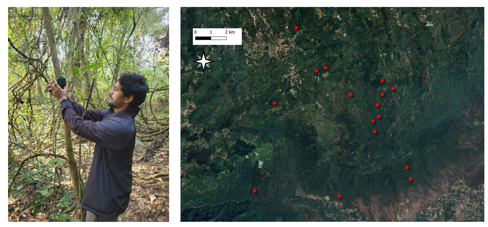
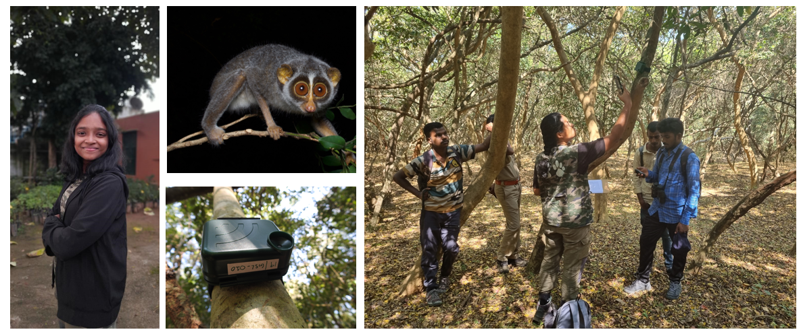
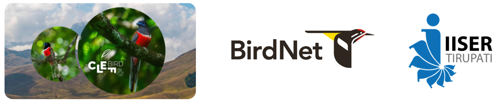
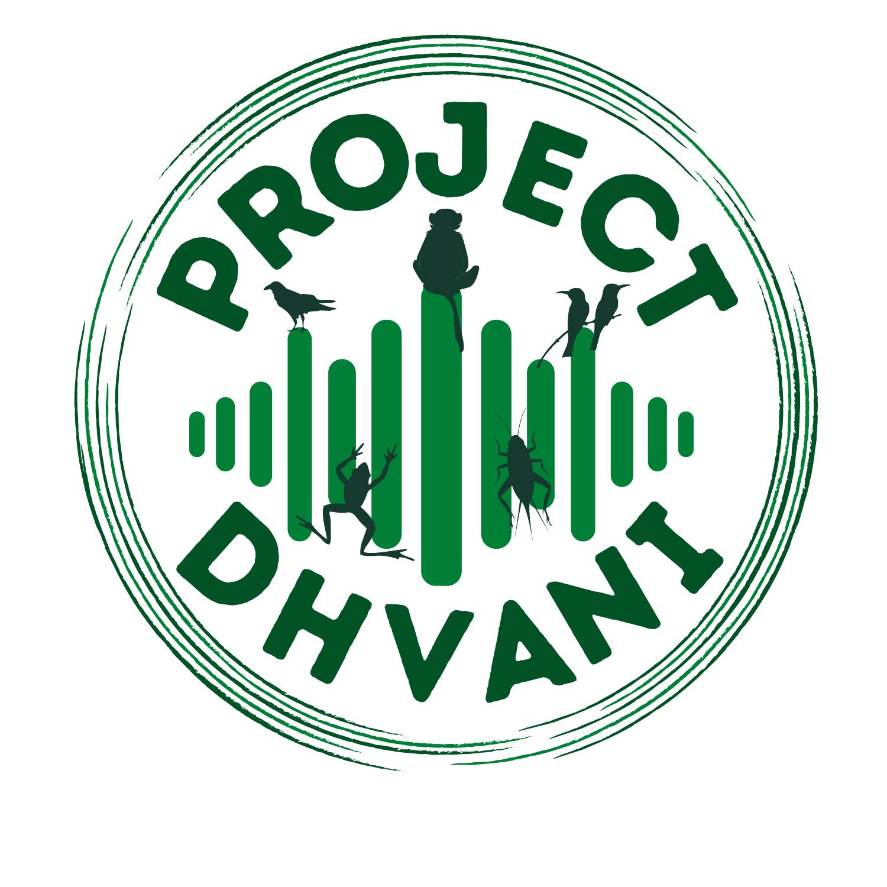

```{r, include=FALSE}
knitr::opts_chunk$set(echo = FALSE)
```

```{css}
/* Unlike the typical distill websites shown in the examples online, I did not want a title YAML/text in the beginning and the first thing I wanted was an image. So this function below, borrowed from a google search, gets rid of the requirement of a title & uses css to do the same. You can delete this code chunk if you want to include a title in your website */

d-title {
    display: none;
  }
  
/*add a custom line of code to include a bit more space at the top for the table of contents*/
.d-contents nav h3 {
    margin-top: 1em;
}
  
/* remove excess margin space around figures */

.figure {
    margin-top: 0em;
    margin-bottom: 0em;
}
```

<p style="color: white">.  </p> 

Bioacoustics offers us a unique opportunity to study wildlife and their environment. Today, passive acoustic monitoring devices are capable of monitoring vocalizing biodiversity across spatial scales for extended periods of time and allows us to study multiple taxonomic groups simultaneously. Below, you will find a map of active and inactive projects across geographies and some information on ongoing projects.  

All acoustic code and analyses can be accessed by visiting this [GitHub repository](https://github.com/vjjan91).  

```{r, layout = "l-page", warning =FALSE}
library(mapview)
library(leafpop)
library(tidyverse)
library(sf)
locations <- read.csv("list-of-sites-for-map.csv") %>%
  st_as_sf(., coords = c("Longitude","Latitude")) %>%
  `st_crs<-`(4326)
mapviewOptions(basemaps = c("CartoDB.Positron","OpenStreetMap.DE"))
mapview(locations, popup = popupTable(locations, zcol = c("Project","Description")))
```

### Restoration bioacoustics  

I am currently working in the Anamalai hills in collaboration with the [Nature Conservation Foundation](https://www.ncf-india.org/) to monitor the recovery of fauna across restored forest fragments.

```{r, fig.cap = "Work published in [Biological Conservation](https://www.sciencedirect.com/science/article/pii/S0006320723001726) showed that active restoration helped increase bird species diversity compared to natural regeneration. Pictured here is an illustration of bird communities across a naturally regenerating (NR), actively restored (AR) and benchmark forests (BM) in the Anamalai hills, Western Ghats. Artist: Chayant Gonsalves. Bonus points if you can spot the audio recorder!"}

knitr::include_graphics("2023-biol-cons.png")
```

### Elevational gradients  

I am currently working in collaboration with the [Keystone Foundation](https://keystone-foundation.org/) and [IISER-Tirupati](https://www.skyisland.in/) to examine how climate and land cover drives bird community assembly along elevational gradients in the Nilgiris.  

```{r, fig.cap = "Faizee Ali Khan, a graduate mentee is seen deploying audio recorders in a forest patch in the Nilgiri Hills. On your right are locations where audio recorders have been deployed since January 2024. These recorders, alongside microclimate data loggers, will continuously collect data for an entire day, for months at a stretch. The elevational gradient ranges between 200m to 2400m."}


```

### Gray slender loris acoustics  

I am collaborating with [Vandana Kannan](https://keystone-foundation.org/team/), who is leading a project examining the acoustic ecology of the Gray slender loris across Sathyamangalam Tiger Reserve.  

```{r, fig.cap = "Vandana Kannan, a wildlife biologist at Keystone Foundation is seen deploying an audio recorder in a forest patch in Sathyamangalam Tiger Reserve. The gray slender loris image can be downloaded from this [link](https://www.inaturalist.org/taxa/74526-Loris-lydekkerianus)."}


```

### AI and bioacoustics  

For the last few years, we have been carefully annotating acoustic data from the Western Ghats biodiversity hotspot. I am now working with scientists at [BirdNET](https://birdnet.cornell.edu/), [Google](https://scholar.google.com/citations?user=M1nVuUgAAAAJ&hl=en), and [IISER-Tirupati](https://www.skyisland.in/) to develop automated algorithms that can detect bird species across the Western Ghats. [Please visit our Kaggle competition here](https://www.kaggle.com/competitions/birdclef-2024/).

```{r}

```

### [Project Dhvani](http://projectdhvani.weebly.com/)  

::: {.floatting}
```{r, out.width = "30%", out.extra='style="float:right; padding:10px"'}

# Upload image here 

```
Pooja Choksi, Sarika Khanwilkar and I co-founded [Project Dhvani](http://projectdhvani.weebly.com/) in 2018, and we are a research collaborative that uses sound to monitor biodiversity and inform resource management. Click [here](http://projectdhvani.weebly.com/) to learn more.
:::  
