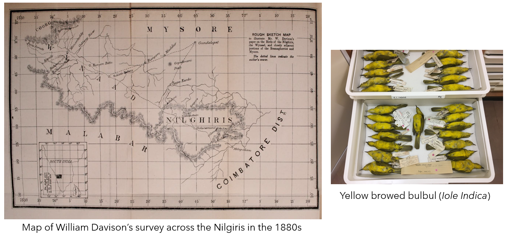

```{r, include=FALSE}
knitr::opts_chunk$set(echo = FALSE)
```

```{css}
/* Unlike the typical distill websites shown in the examples online, I did not want a title YAML/text in the beginning and the first thing I wanted was an image. So this function below, borrowed from a google search, gets rid of the requirement of a title & uses css to do the same. You can delete this code chunk if you want to include a title in your website */

d-title {
    display: none;
  }

/*add a custom line of code to include a bit more space at the top for the table of contents*/
.d-contents nav h3 {
    margin-top: 1em;
}
  
/* remove excess margin space around figures */

.figure {
    margin-top: 0em;
    margin-bottom: 0em;
}
```
<p style="color: white">.  </p> 

The field of historical ecology aims to taps into a plethora of historical datasets available to inform biodiversity conservation. Using data from historical maps, satellite images, diaries of ornithologists and old journal articles, I am studying the impacts of environmental change on bird diversity.  

### Nilgiris resurvey project  

The Nilgiri hills of the Western Ghats is one of the most biodiverse landscapes on Earth. Since the 1800s, geographers, anthropologists, ecologists and others have studied the biological and cultural diversity of this landscape. As a result, we have a rich treasure of historical data that can be used to better understand the legacies of landscape change and ongoing climate change. By carrying out historical resurveys across sites where bird species were reported from a century ago, we can ask how habitat loss and climate change are impacting bird species today.      

All code and analyses associated with this project can be found [here](https://github.com/vjjan91/nilgiris-resurvey-project).  

```{r, fig.cap = "An 1848 land cover map of the Nilgiri hills, based on a survey carried out by Captain John Ouchterlony. Sources: Tamil Nadu State Archive and the British Library."}

knitr::include_graphics("historical-map.png")
```

```{r, fig.cap = "William Davison's detailed surveys in the 1880s resulted in the collection of thousands of specimens of birds from the Nilgiri hills. On your right are specimens of the Yellow-browed bulbul, photographed at the Natural History Museum, Tring, UK."}


```

### Historical datasets  

One of the most challenging aspects of the Nilgiris resurvey project has been collating and putting together interdisciplinary datasets - ranging from letters written by ornithologists to old maps to climatic datasets to paintings, for example. I am currently working on making this database public - please revisit this section soon.  

```{r, fig.cap = "A letter dated 1958, indicating what needs to be done about Hugh Whistler's notes on Indian birds and if they should be given to Salim Ali and S D Ripley."}

knitr::include_graphics("letter-to-Ali.jpg")
```

```{r, fig.cap = "A photograph of Hulical Durg, taken in the 1870s by famed photographer, A T W Penn alongside a painting of the Malabar parakeet by Margaret Cockburn."}


```

