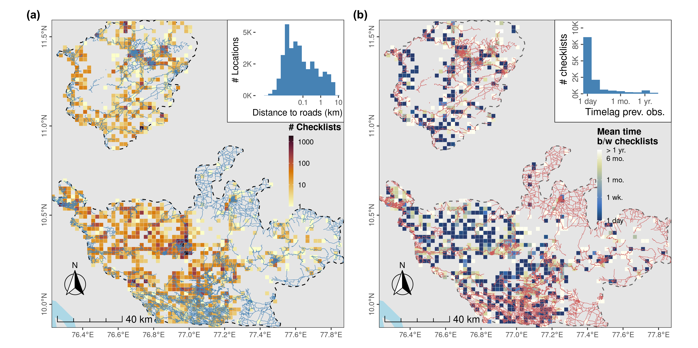
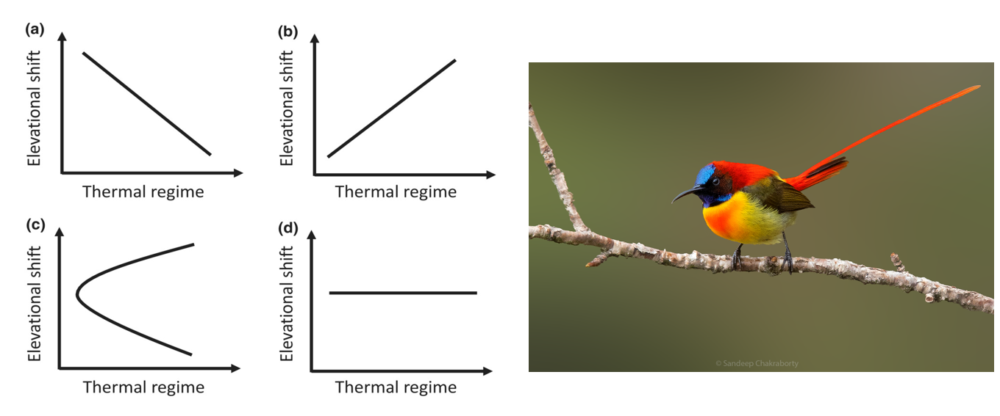

```{r setup, include=FALSE}
knitr::opts_chunk$set(echo = FALSE)
```

```{css}
/* Unlike the typical distill websites shown in the examples online, I did not want a title YAML/text in the beginning and the first thing I wanted was an image. So this function below, borrowed from a google search, gets rid of the requirement of a title & uses css to do the same. You can delete this code chunk if you want to include a title in your website */

d-title {
    display: none;
  }

/*add a custom line of code to include a bit more space at the top for the table of contents*/
.d-contents nav h3 {
    margin-top: 1em;
}
  
/* remove excess margin space around figures */

.figure {
    margin-top: 0em;
    margin-bottom: 0em;
}
```
<p style="color: white">.  </p>  

The advent of large-scale citizen science datasets has now made it possible to carry out a wide range of research across a number of species, including mapping species distributions and prioritizing conservation efforts. Using data from the world's largest citizen science database, [eBird](https://ebird.org/home), I study how the environment shapes species behavior, habitat use and its distribution.  

All code and analyses can be accessed by visiting this [GitHub repository](https://github.com/vjjan91).    

### Occupancy modeling  

We use data from eBird to understand how climate and land cover drives bird distributions. Recently, [we found that](https://nsojournals.onlinelibrary.wiley.com/doi/full/10.1111/ecog.06075) temperature seasonality is a key driver of species occupancy for forest and generalist bird species in the Western Ghats.  

```{r, fig.cap = "Distribution of sampling effort in the form of eBird checklists in the Nilgiri and Anamalai hills between 2013 and 2021. Source: [Ramesh et al. 2022](https://nsojournals.onlinelibrary.wiley.com/doi/full/10.1111/ecog.06075)."}


```

### Elevational migration

Elevational migration is a globally ubiquitous behaviour. We use citizen science datasets to understand the mechanisms that explain variation in elevational movement. Recently, [we found that](https://onlinelibrary.wiley.com/doi/full/10.1111/geb.13761) most Himalayan birds showed downslope shifts in the winter and that elevational shift was negatively associated with a species' thermal regime.   

```{r, fig.cap = "Four potential patterns of elevational shift based on species matching or switching their elevational thermal regimes. (a) Taxa with the greatest shift have the narrowest thermal regime (niche tracking), (b) taxa with the greatest shift have the widest thermal regime (niche switching), (c) taxa with smallest and greatest shifts have the widest thermal regimes (intermediate shifts have the narrowest thermal regimes and (d) no relationship between elevational shift and thermal regime. Source: [Menon et al. 2023](https://onlinelibrary.wiley.com/doi/full/10.1111/geb.13761). On your right is the Fire-tailed Sunbird, which migrates over 1500 metres downslope in the winter. Photo credit: Sandeep Chakraborty"}


```


