```{r setup, include=FALSE}
knitr::opts_chunk$set(echo = FALSE)
```

```{css}
/* Unlike the typical distill websites shown in the examples online, I did not want a title YAML/text in the beginning and the first thing I wanted was an image. So this function below, borrowed from a google search, gets rid of the requirement of a title & uses css to do the same. You can delete this code chunk if you want to include a title in your website */

d-title {
    display: none;
  }

/*add a custom line of code to include a bit more space at the top for the table of contents*/
.d-contents nav h3 {
    margin-top: 1em;
}

/* remove excess margin space around figures */

.figure {
    margin-top: 0em;
    margin-bottom: 0em;
}
```

### 2024  

__Aug__: Mongabay India features my work in their podcast - 'Wild Frequencies'. __Click on the image below to listen in__.  

[](https://www.youtube.com/watch?v=aM64gE1KOps "Wild Frequencies")  

__July__: I was recently interviewed for an article in [Nature India](https://www.nature.com/articles/d44151-024-00096-6) on the applications of AI in the field of bioacoustics.    

__May__: Faizee Ali Khan defended his Master's thesis successfully. Congrats Faizee!  

__March__: I gave a talk on soundscapes in coffee farms at the Black Baza Roastery, in Bangalore, India.  

__January__: I was invited by the Ecological Restoration Alliance, India for an online webinar on the use of conservation bioacoustics to monitor the impacts of ecological restoration. __Click on the image below to view the talk__.  

[](https://www.youtube.com/watch?v=abmBA6n3_r4 "ERA")     

### 2023  

::: {.floatting}
```{r, out.width = "30%", out.extra='style="float:right; padding:10px"'}

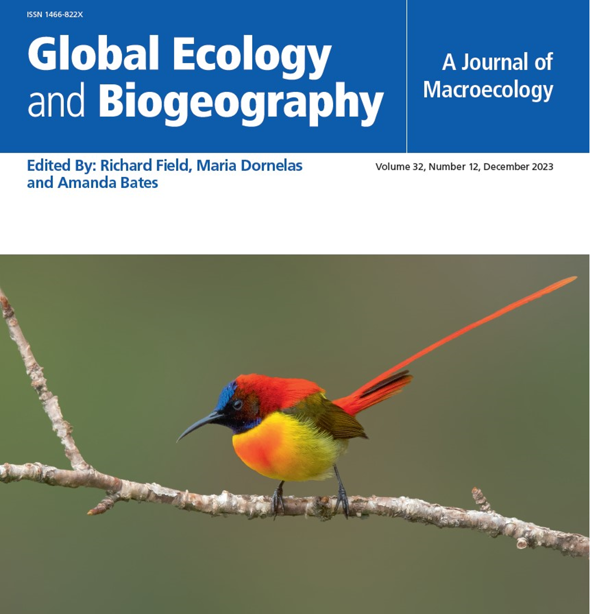
```
__September__: I co-authored a publication, led by Tarun Menon, examining altitudinal migration in Himalayan Birds in *Global Ecology and Biogeography*. We made the cover!      
:::


__July__: I co-authored a publication, led by Sarab Sethi, on the generalizability of soundscapes across landscapes in *Nature Ecology and Evolution*.  

__July__: I attended and presented the annual meeting of the Association for Tropical Biology and Conservation in Coimbatore, India. Here, I gave two talks, organized a workshop and a [symposium on conservation bioacoustics](https://www.atbc2023.org/symposia/conservation-acoustics). I was also invited as a panelist by the National Geographic Society to speak about grant writing and raising funds for research.    

__April__: My second Ph.D. chapter - Using passive acoustic monitoring to assess faunal recovery in the Western Ghats is now published in *Biological Conservation*. Please head over to the publications page for more details.  

__March__: I organized a symposium on ['Studying birds using passive acoustic monitoring'](https://www.birdmonitoring.in/schedule/#) as part of the Bird Monitoring in India. The symposium included 9 oral presentations and a keynote lecture.   

__March__: I am honored to have been elected as the [Secretary for the Asia-Pacific chapter of the Association for Tropical Biology and Conservation](https://tropicalbiology.org/about-us/asia-pacific-chapter/). My term begins in March 2023 and is until March 2025.  

__January__: I am proud to co-author a publication with Pooja Choksi and Sarika Khanwilkar. This paper was published in *Restoration Ecology* and examined the impacts of ecological restoration on fauna, using bioacoustics. Please go to the publications page for more details.  

### 2022  

__December__: I started my postdoctoral fellowship at the [K. Lisa Yang Center for Conservation Bioacoustics, Cornell Lab of Ornithology](https://www.birds.cornell.edu/home/staff/vijay-ramesh/) and gave a seminar on my research journey so far.  

__September__: Pooja Choksi, Sarika Khanwilkar, Krishna Anujan and I won a National Geographic Society Meridian Grant.  

__July__: I attended and presented at two conferences - the American Ornithological Society's annual meeting in Puerto Rico and at the Association for Tropical Biology and Conservation annual meeting in Cartagena.  

::: {.floatting}
```{r, out.width = "30%", out.extra='style="float:right; padding:10px"'}

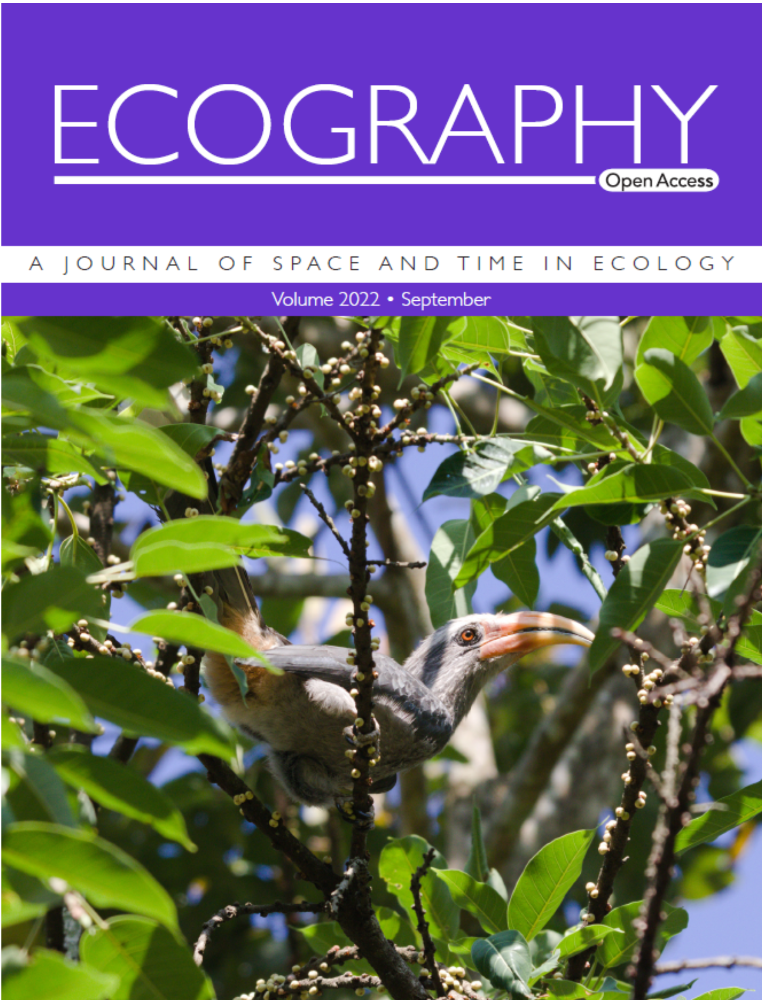
```
__June__: My first Ph.D chapter - using eBird data to model the role of climate and land cover on bird occupancy in the Western Ghats - is now published in *Ecography*. We also made the cover of this journal!       
:::


__May__: I defended my Ph.D. and received a doctoral degree in Ecology, Evolution, and Environmental Biology.  

__May__: [Project Dhvani](http://projectdhvani.weebly.com/) was featured in an article in the [Shaastra Magazine](https://shaastramag.iitm.ac.in/special-feature/tech-gone-wild).  

### 2021  

__December__: I was awarded the Rose Postdoctoral Fellowship at the Cornell Lab of Ornithology. I am honored and excited to begin this fellowship next year!  

__November__: I gave a seminar at the BioacousTalks series organized by the [K. Lisa Yang Center for Conservation Bioacoustics, Cornell Lab of Ornithology](https://www.birds.cornell.edu/ccb/bioacoustalks/).  

__October__: [Project Dhvani](http://projectdhvani.weebly.com/) was featured in the [Hindustan Times](https://www.hindustantimes.com/lifestyle/art-culture/saving-every-tweet-meet-the-researchers-using-bird-calls-and-ai-to-study-biodiversity-101634283069252.html).   

__September__: Sarthak Shetty, an undergraduate mentee, and I published an open-source Python package for scientific text analysis in *Ecology and Evolution*. Head over to the publications page for more details.  

__April__: I gave an invted seminar on forest soundscapes of the Western Ghats at the International Centre for Theoretical Science. __Click on the image below to view the talk__.  

[](https://www.youtube.com/watch?v=-lxXAtGQ6Ok "ICTS")   

### 2020  

__November__: I was invited to the Lunchtime Lecture at the Linnean Society. Here, I spoke about how technology is being used in the field to record and monitor wildlife. __Click on the image below to view the talk__.  

[](https://www.youtube.com/watch?v=wv_DSYh2O2o "Linnean Lecture")  

__September__: My undergraduate thesis finally sees the light of day! A manuscript describing hidden cryptic diversity among the *Indirana* and *Walkerana* genus of frogs is now out on *PLOS ONE*. See publications page for details.  

::: {.floatting}
```{r, out.width = "30%", out.extra='style="float:right; padding:10px"'}

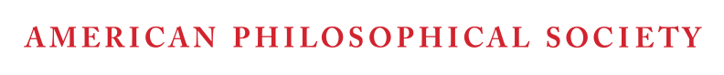
```
__April__: I am proud to have received the Lewis and Clark Exploration Fund from the American Philosophical Society.   
:::

::: {.floatting}
```{r, out.width = "30%", out.extra='style="float:right; padding:10px"'}

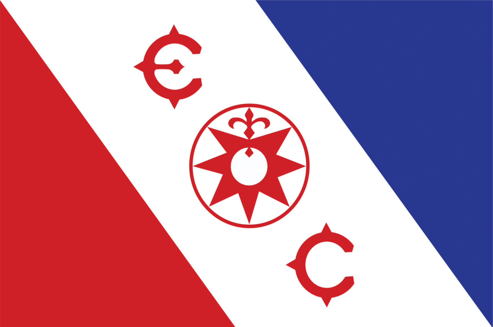
```
__April__: I received an Exploration Fund Grant from the Explorers Club to carry out a historical resurvey across the Nilgiri hills.   
::: 


::: {.floatting}
```{r, out.width = "30%", out.extra='style="float:right; padding:10px"'}


```
__February__: I received an early career grant from the National Geographic Society.     
::: 

__January__: We described a new frog species endemic to the Western Ghats, _Walkerana muduga_ in the journal, *Zootaxa*. Please visit the publications page for more details.    

### 2019   

::: {.floatting}
```{r, out.width = "30%", out.extra='style="float:right; padding:10px"'}

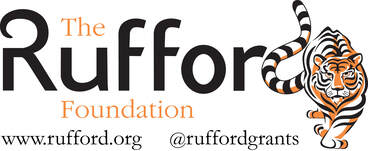
```
__November__: I received a [small research grant](https://www.rufford.org/projects/vijay-ramesh/conservation-through-sounds-using-acoustics-to-evaluate-the-effectiveness-of-forest-restoration/) from the Rufford Foundation to monitor vocalizing biodiversity across the Valparai plateau, Western Ghats. 
::: 

::: {.floatting}
```{r, out.width = "30%", out.extra='style="float:right; padding:10px"'}

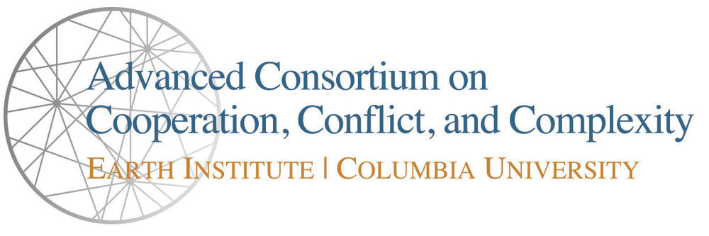
```
__January__: [Project Dhvani](http://projectdhvani.weebly.com/) received the Student Research Fellowship Grant from the Advanced Consortium on Cooperation, Conflict and Complexity at Columbia University.
:::  

### 2018    

__July__: In an article in Mongabay on how climate change affects breeding and nesting patterns of birds, I spoke about how citizen science and historical information could be used to understand how warming climates are affecting avian distributions as well as migratory patterns. You can find the article [here](https://india.mongabay.com/2018/07/is-it-time-yet-climate-change-disturbs-breeding-and-nesting-season-in-birds/).  

__June__: [Pooja Choksi](https://poojachoksi.weebly.com/), [Sarika Khanwilkar](https://www.linkedin.com/in/sarikakhanwilkar/?originalSubdomain=in) and I piloted a soundscapes study in the Western Ghats and Central India in the summer. Our goals were to test if we could monitor biodiversity using sounds. We ended up founding a new research collaborative called [Project Dhvani](http://projectdhvani.weebly.com/).   

__April__: I lead a workshop on carrying out 'Spatial Analysis Using R' at the US - International Association for Landscape Ecology regional conference in Chicago. All materials for the workshop are [available here](https://github.com/vjjan91/SpatialAnalysisinR).  

::: {.floatting}
```{r, out.width = "30%", out.extra='style="float:right; padding:10px"'}

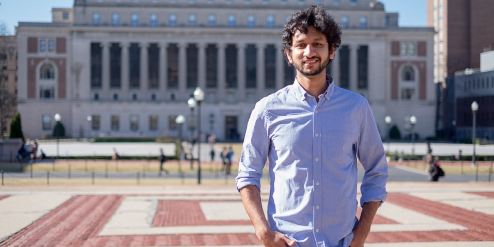
```
__March__: The Graduate School of Arts and Sciences at Columbia University interviewed me for the Student Spotlight series. You can find the [entire transcript here](https://www.gsas.columbia.edu/news/vijay-ramesh-phd-candidate-ecology-evolution-and-environmental-biology).
:::  

### 2017  

__October__: I presented the results of my Master's thesis at the Student Conference in Conservation Science, New York and was awarded 'Best Talk for Best Use of Quantitative Methods in Conservation Research'. __Click on the image below to view the talk__.  

[](https://www.youtube.com/watch?v=G9OlKMISv_A "SCCS-NY 2017: Best Talk")

__September__: I co-authored a publication on incorporating conflict resolution theory and practice in the Ecuadorian Amazon in the journal, *Conflict Resolution Quarterly*. This was a fun project that emerged from a class I took as a Master's student. Please visit the publications page to access the same.  

__April__: My master's thesis co-authored with Trisha Gopalakrishna, Sahas Barve and Don J Melnick just got published in *Biological Conservation*. We show that ranges have been overestimated by BirdLife International (BLI) for 17 of the 18 endemic birds examined and thereby, inflating the threat levels on the IUCN Red List. Please visit the publications page to access the same.   

__January__: I will starting my Ph.D. in the Fall, at the Department of Ecology, Evolution, and Environmental Biology (E3B), Columbia University. I was awared the Dean's fellowship to pursue my doctoral education.  

### 2016

::: {.floatting}
```{r, out.width = "30%", out.extra='style="float:right; padding:10px"'}

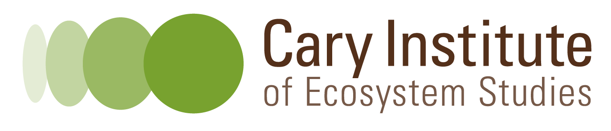
```
__June__: I joined the Cary Institute of Ecosystem Studies as a Spatial and Computational Data Manager, working with [Dr. Barbara Han](https://www.hanlab.science/).  
:::

### 2015  

__October__: I was awarded the Best Speed Talk award at the Student Conference on Conservation Science, New York. __Click on the image below to view the talk__.    

```{r}
## Ingenious solution for placing thumbnail and youtube video
## https://stackoverflow.com/questions/14192709/is-it-possible-to-embed-youtube-vimeo-videos-in-markdown-using-a-c-sharp-markdow
```

[](https://www.youtube.com/watch?v=Dm0A4Rm402U "SCCS-NY 2015: Best Talk")

::: {.floatting}
```{r, out.width = "30%", out.extra='style="float:right; padding:10px"'}

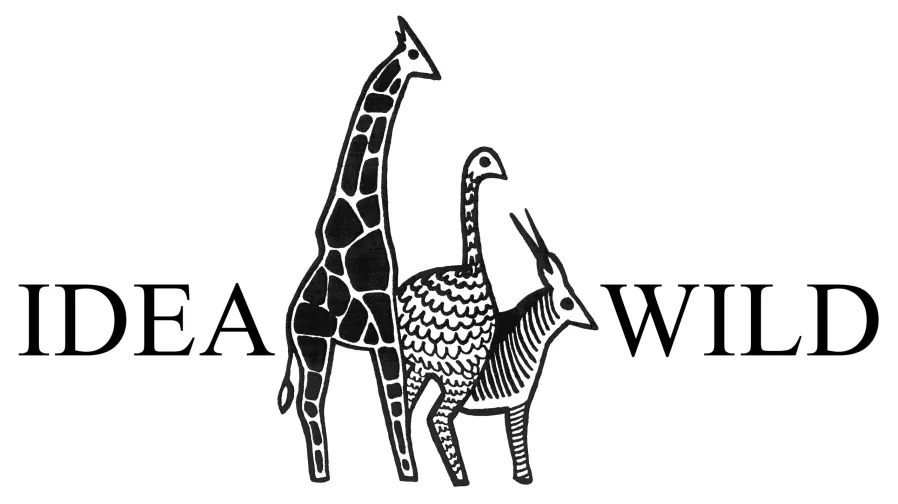
```
<p style="color: white">.  </p> 
__July__: IDEA WILD is providing me equipment to carry out field work in the Western Ghats.
:::

::: {.floatting}
```{r, out.width = "30%", out.extra='style="float:right; padding:10px"'}

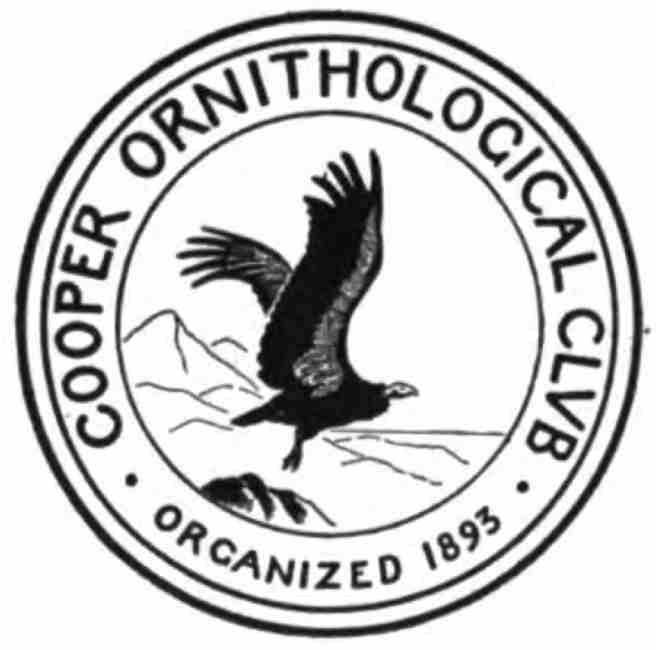
```
<p style="color: white">.  </p> 
__May__: I received the Mewaldt-King Student Research Award from the Cooper Ornithological Society to fund my master's thesis work.  
:::

::: {.floatting}
```{r, out.width = "30%", out.extra='style="float:right; padding:10px"'}

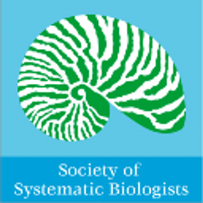
```
<p style="color: white">.  </p> 
__May__: I received the Society of Systematic Biologists Travel Award to attend the Standalone meeting in Michigan. I presented my findings on cryptic diversity within the *Indirana* genus of frogs.    
:::

### 2014

__September__: I started grad school in the fall of 2014 at Columbia University. I will be majoring in Conservation biology and expect to graduate in May 2016. 
