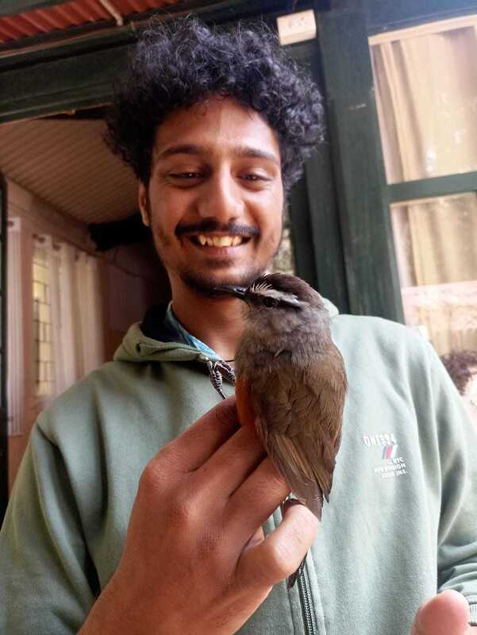
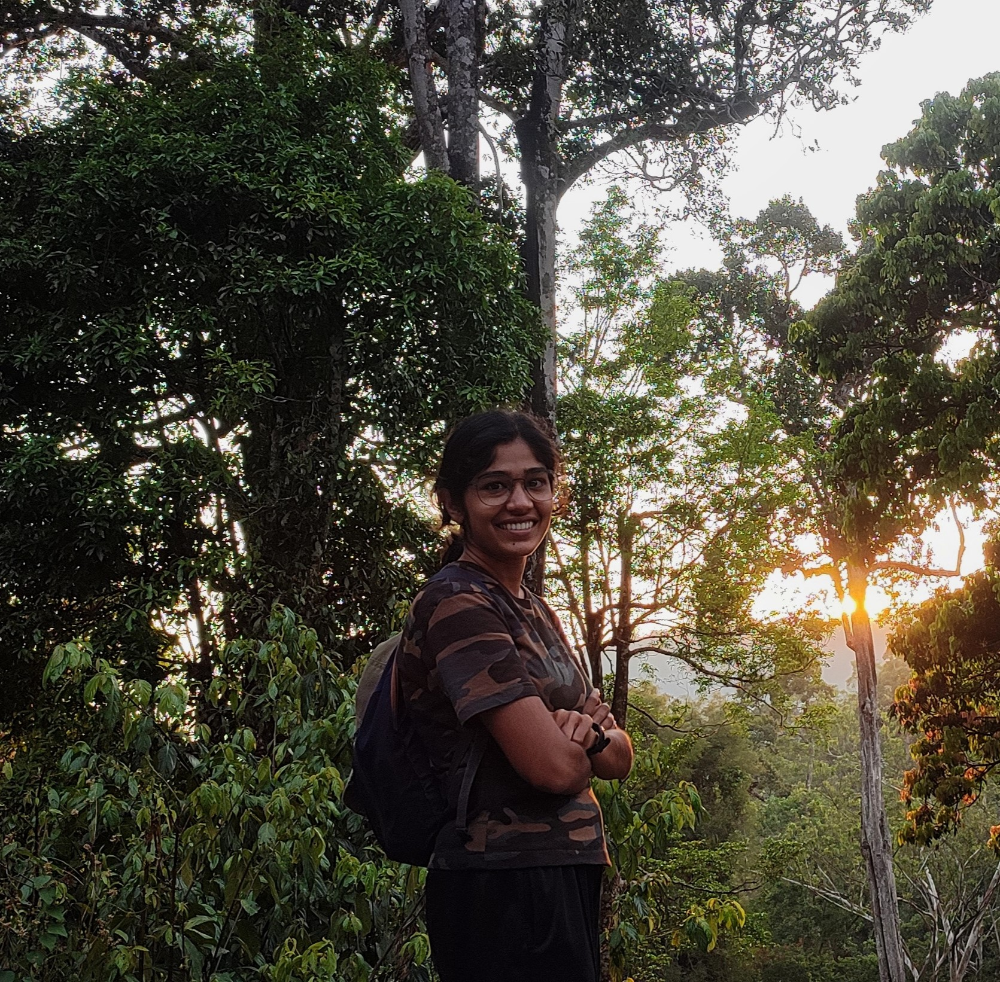
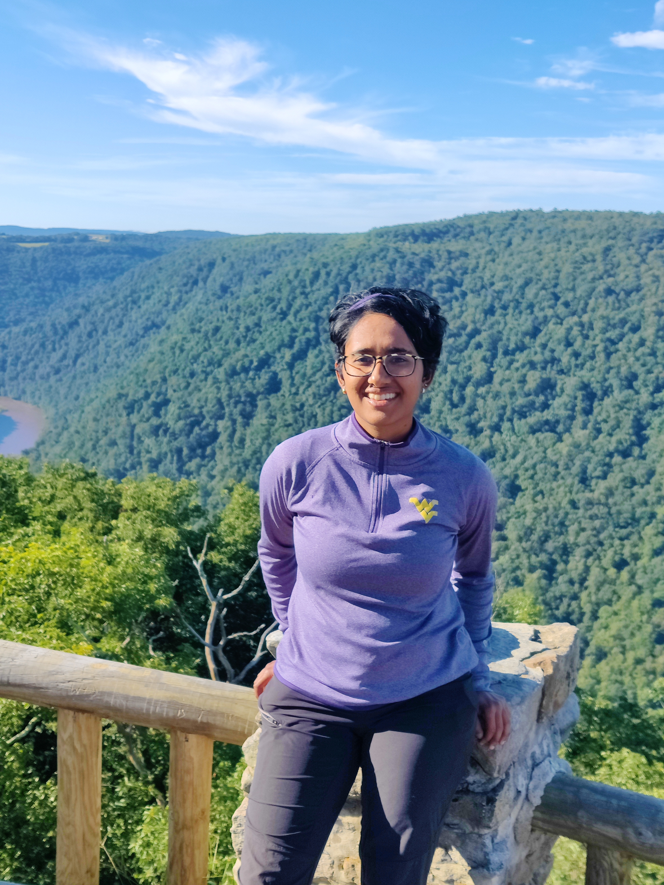
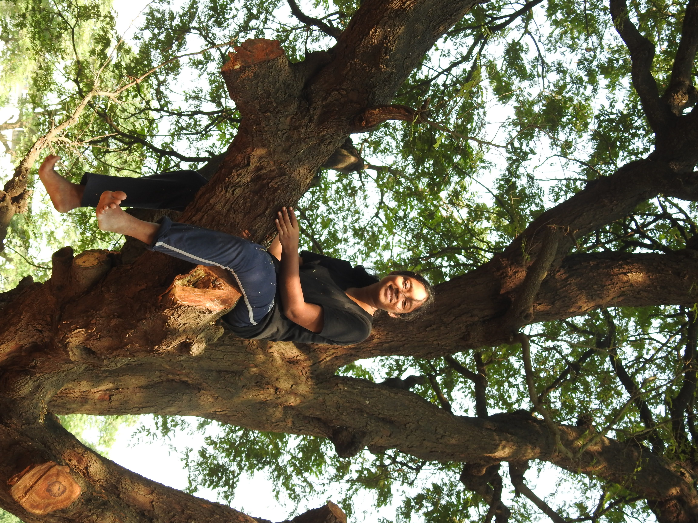
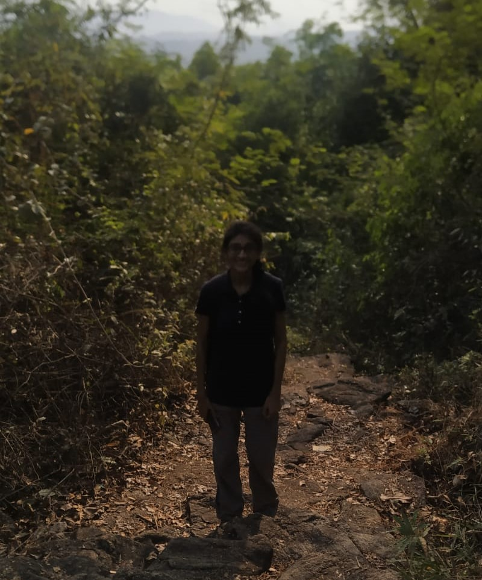
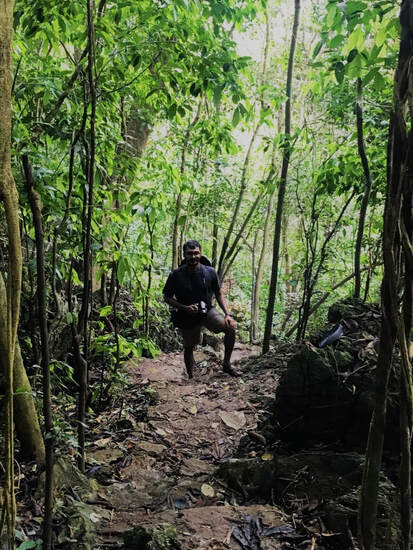
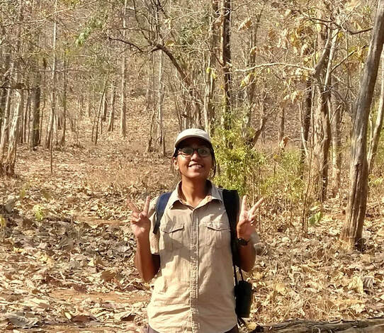

```{r setup, include=FALSE}
knitr::opts_chunk$set(echo = FALSE)

# Learn more about creating websites with Distill at:
# https://rstudio.github.io/distill/website.html

# Learn more about publishing to GitHub Pages at:
# https://rstudio.github.io/distill/publish_website.html#github-pages
```

```{css}
/* Unlike the typical distill websites shown in the examples online, I did not want a title YAML/text in the beginning and the first thing I wanted was an image. So this function below, borrowed from a google search, gets rid of the requirement of a title & uses css to do the same. You can delete this code chunk if you want to include a title in your website */

d-title {
    display: none;
  }
```

::: {.floatting}
```{r, out.width = "50%", out.extra='style="float:left; padding:20px"'}

# Upload headshot here 
knitr::include_graphics("figs/vijay-ramesh-headshot.jpg")
```
<p style="color: white">.  </p>  
 
<p style="color: #033F63">**Vijay Ramesh**</p>    

[Rose Postdoctoral Fellow](https://www.birds.cornell.edu/home/staff/vijay-ramesh/)  
K. Lisa Yang Center for Conservation Bioacoustics  
Cornell Lab of Ornithology  

[Visiting Postdoctoral Fellow](https://www.skyisland.in/)      
Indian Institute of Science Education and Research, Tirupati, India    


:::  
  
  
::: {.floatting}
```{r, out.width = "50%", out.extra='style="float:left; padding:20px"'}

# Upload headshot here 

```
<p style="color: white">.  </p>
<p style="color: #033F63">**Faizee Ali Khan**</p>    

[Graduate mentee](https://www.skyisland.in/faizee.html)  
Indian Institute of Science Education and Research, Tirupati, India  

Faizee is co-mentored by Vijay & [Dr. VV Robin](https://www.skyisland.in/robin.html) for his master's degree. His research investigates the drivers of seasonal elevational migration across bird communities in the Western Ghats.  
:::  
  
  
::: {.floatting}
```{r, out.width = "50%", out.extra='style="float:left; padding:20px"'}

# Upload headshot here 

```
<p style="color: white">.  </p>
<p style="color: #033F63">**Swathi C S**</p>    

Graduate mentee   
  
Swathi is co-mentored by [Priyanka Hari Haran](https://tropicos.netlify.app/author/priyanka-hari-haran/) and is leading a collaborative study that tests the effects of habitat fragmentation on song characteristics of the Malabar Whistling Thrush.  
:::  


::: {.floatting}
```{r, out.width = "50%", out.extra='style="float:left; padding:20px"'}

# Upload headshot here 

```
<p style="color: white">.  </p>
<p style="color: #033F63">**Pavithra Sundar**</p>    

Graduate mentee   
  
Pavithra is testing the acoustic niche partitioning hypothesis across a bird community in the Anamalai hills of the Western Ghats.      
:::


::: {.floatting}
```{r, out.width = "50%", out.extra='style="float:left; padding:20px"'}

# Upload headshot here 

```
<p style="color: white">.  </p>
<p style="color: #033F63">**Vandana Kannan**</p>    

[Wildlife Biologist, Keystone Foundation](https://keystone-foundation.org/team/)   
  
Vandana is examining the acoustic ecology of the Grey slender loris.       
:::

  
## Alumni       

::: {.floatting}
```{r, out.width = "50%", out.extra='style="float:left; padding:20px"'}

# Upload headshot here 

```
<p style="color: white">.  </p>
<p style="color: #033F63">**Meghana Srivathsa**</p>    

Research assistant (2021 - 2023)     
  
Meghana worked on numerous bioacoustics projects across the Anamalai hills of the Western Ghats. These projects involved listening to over 150 hours of audio recordings and manually annotating the presence/absence of every bird species in those recordings. 
:::
  
  
::: {.floatting}
```{r, out.width = "50%", out.extra='style="float:left; padding:20px"'}

# Upload headshot here 

```
<p style="color: white">.  </p>
<p style="color: #033F63">**Akshay V Anand**</p>    

Research assistant (2020 - 2022)  
*Current: Graduate Student, University of Florida*  
  
Akshay was a research assistant on a bioacoustics and a historical resurvey project across the Anamalai and the Nilgiri hills of the Western Ghats. He manually annotated acoustic data from the Anamalai hills & carried out extensive fieldwork across the Nilgiri hills.  
:::
     
      
::: {.floatting}
```{r, out.width = "50%", out.extra='style="float:left; padding:20px"'}

# Upload headshot here 

```
<p style="color: white">.  </p>
<p style="color: #033F63">**Amrutha Rajan**</p>    

Research assistant (2020 - 2022)  
*Current: Project Assistant, Keystone Foundation*  
  
Amrutha digitized historical land cover data and carrying out fieldwork across the Nilgiris.  
:::    

