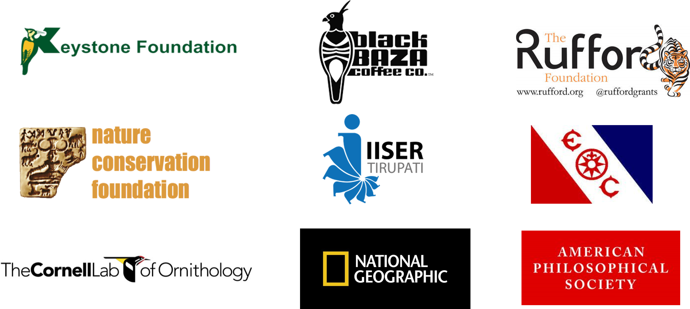

```{r setup, include=FALSE}
knitr::opts_chunk$set(echo = FALSE)
```

```{css}
/* Unlike the typical distill websites shown in the examples online, I did not want a title YAML/text in the beginning and the first thing I wanted was an image. So this function below, borrowed from a google search, gets rid of the requirement of a title & uses css to do the same. You can delete this code chunk if you want to include a title in your website */

d-title {
    display: none;
  }

/* remove excess margin space around figures */

.figure {
    margin-top: 0em;
    margin-bottom: 0em;
}
```

::: {.floatting}
```{r, out.width = "300px", out.extra='style="float:left; padding:20px"'}

# Upload headshot here 
knitr::include_graphics("figs/vijay-ramesh-headshot.jpg")
```
<p style="color: white">.  </p>
<p style="color: #033F63">**Vijay Ramesh**</p>    

[Rose Postdoctoral Fellow](https://www.birds.cornell.edu/home/staff/vijay-ramesh/)    
K. Lisa Yang Center for Conservation Bioacoustics  
Cornell Lab of Ornithology  

[Download CV]("files/ramesh-vijay-cv-feb-2024.pdf")
::: 

### Collaborators and funding 

I believe that science is a team-effort and none of the work I do would be possible without collaborations and partnerships. I am also thankful for all the funding sources that have made my work possible. A few select partners and funding sources can be found below. 

```{r}

```

To learn more about the work carried out by my collaborators (current and former), please visit their work by clicking on their names (listed in no particular order): [Priyanka Hari Haran](https://tropicos.netlify.app/author/priyanka-hari-haran/), [Laurel Symes](https://www.birds.cornell.edu/ccb/laurel-b-symes-ph-d/), [Pratik Rajan Gupte](https://scholar.google.nl/citations?user=ve_IGT8AAAAJ&hl=en), [VV Robin](https://www.skyisland.in/), [Morgan W. Tingley](https://www.morgantingley.com/), [Ruth S DeFries](https://www.ruthdefries.e3b.columbia.edu/ruth-defries/), [Divya Mudappa](https://www.ncf-india.org/author/646399/divya-mudappa), [T R Shankar Raman](https://www.ncf-india.org/author/646400/t-r-shankar-raman), [Anita Varghese](https://keystone-foundation.org/team/), [Sahas Barve](http://www.sahasbarve.com/), [Tarun Menon](https://tarunmenon.wordpress.com/), [Sarab Sethi](https://www.imperial.ac.uk/people/sarab.sethi), [Pooja Choksi](https://poojachoksi.weebly.com/), [Sarika Khanwilkar](https://www.linkedin.com/in/sarikakhanwilkar/?originalSubdomain=in), [Vijayakumar S P](https://www.researchgate.net/profile/Vijayakumar-S-P), [Kartik Shanker](https://kslab.weebly.com/), [Nature Conservation Foundation](https://www.ncf-india.org/), [Keystone Foundation](https://keystone-foundation.org/), [Black Baza Coffee Co.](https://store.blackbazacoffee.com/)     

### Mentees  

Current and former mentees and their research are highlighted below:      

::: {.floatting}
```{r, out.width = "250px", out.extra='style="float:left;padding:20px"'}

# Upload headshot here 
knitr::include_graphics("figs/faizee-profile.jpg")
```
<p style="color: white">.  </p>
<p style="color: #033F63">**Faizee Ali Khan**</p>    

Faizee is co-mentored by Vijay & [Dr. VV Robin](https://www.skyisland.in/robin.html) for his master's degree. His research investigates the drivers of seasonal elevational migration across bird communities in the Western Ghats.  
:::  
  

::: {.floatting}
```{r, out.width = "250px", out.extra='style="float:left; padding:20px"'}

# Upload headshot here 
knitr::include_graphics("figs/swathi-profile.jpeg")
```
<p style="color: white">.  </p>
<p style="color: #033F63">**Swathi C S**</p>    

Swathi is co-mentored by [Priyanka Hari Haran](https://tropicos.netlify.app/author/priyanka-hari-haran/) and is leading a collaborative study that tests the effects of habitat fragmentation on song characteristics of the Malabar Whistling Thrush.  
:::  


::: {.floatting}
```{r, out.width = "250px", out.extra='style="float:left; padding:20px"'}

# Upload headshot here 
knitr::include_graphics("figs/pavithra-profile.jpg")
```
<p style="color: white">.  </p>
<p style="color: #033F63">**Pavithra Sundar**</p>    

Pavithra is testing the acoustic niche partitioning hypothesis across a bird community in the Anamalai hills of the Western Ghats.      
:::


::: {.floatting}
```{r, out.width = "250px", out.extra='style="float:left; padding:20px"'}

# Upload headshot here 
knitr::include_graphics("figs/vandana-profile.jpg")
```
<p style="color: white">.  </p>
<p style="color: #033F63">**Vandana Kannan**</p>    

Vandana is examining the acoustic ecology of the Grey slender loris.      
:::


::: {.floatting}
```{r, out.width = "250px", out.extra='style="float:left; padding:20px"'}

# Upload headshot here 
knitr::include_graphics("figs/meghana-srivathsa-profile.jpg")
```
<p style="color: white">.  </p>
<p style="color: #033F63">**Meghana Srivathsa**</p>    

Meghana worked as a research assistant (2021 - 2023) on numerous bioacoustics projects, with a focus on birds of the Western Ghats.
:::
  
  
::: {.floatting}
```{r, out.width = "250px", out.extra='style="float:left; padding:20px"'}

# Upload headshot here 
knitr::include_graphics("figs/akshay-anand-profile.jpg")
```
<p style="color: white">.  </p>
<p style="color: #033F63">**Akshay V Anand**</p>    

*Current: Graduate Student, University of Florida*  
  
Akshay worked as a research assistant (2020-2022) on a bioacoustics and a historical resurvey project across the Anamalai and the Nilgiri hills of the Western Ghats.
:::
     
      
::: {.floatting}
```{r, out.width = "250px", out.extra='style="float:left; padding:20px"'}

# Upload headshot here 
knitr::include_graphics("figs/amrutha-rajan-profile.jpg")
```
<p style="color: white">.  </p>
<p style="color: #033F63">**Amrutha Rajan**</p>    
 
Amrutha was as a research assistant (2020-2022) on a historical resurvey project across the Nilgiris.  
:::    

