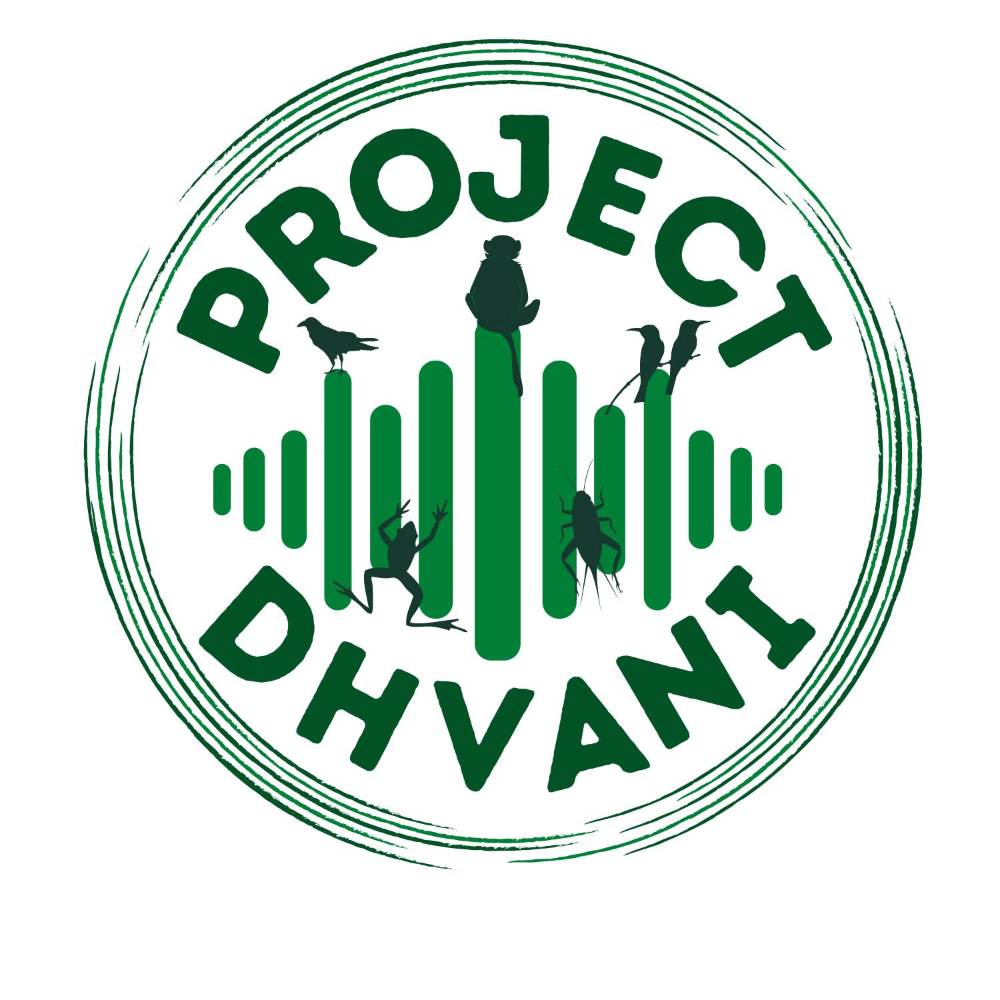

```{r setup, include=FALSE}
knitr::opts_chunk$set(echo = FALSE)

# Learn more about creating websites with Distill at:
# https://rstudio.github.io/distill/website.html

# Learn more about publishing to GitHub Pages at:
# https://rstudio.github.io/distill/publish_website.html#github-pages
```

```{css}
/* Unlike the typical distill websites shown in the examples online, I did not want a title YAML/text in the beginning and the first thing I wanted was an image. So this function below, borrowed from a google search, gets rid of the requirement of a title & uses css to do the same. You can delete this code chunk if you want to include a title in your website */

d-title {
    display: none;
  }
```

<p style="color: white">.  </p> 

My research aims to understand how habitat loss and climatic changes impact bird species distributions, behavior, and their ecology. A common thread in my experience working with birds has been the terrain that I have studied them in: mountains. I use a wide array of tools and techniques to test fundamental ecological theory and its applications.  

There are three broad lenses through which I study bird communities: Conservation Bioacoustics, Historical Ecology, and citizen science.   

To learn more about the current list of active projects and geographies we work in, please visit this page. 

## Conservation Bioacoustics  

Bioacoustics offers us a unique opportunity to study wildlife and their environment. Passive acoustic monitoring devices are capable of monitoring vocalizing biodiversity across broad spatial scales for extended periods of time and allows us to study multiple taxonomic groups simultaneously. Presently, we are working on a range of projects that includes tracking and monitoring bird vocal activity across habitats, understanding the drivers of the dawn chorus, documenting soundscapes in coffee farms, recording vocalizations of an endangered primate, using AI to carry out automated recognition of sounds etc. To learn more, please visit the link at the top of this page.  

```{r, layout="l-body-outset", fig.cap = "Work published in [Biological Conservation](https://www.sciencedirect.com/science/article/pii/S0006320723001726) showed that active restoration helped increase bird species diversity compared to natural regeneration. Pictured here is an illustration of bird communities across a naturally regenerating (NR), actively restored (AR) and benchmark forests (BM) in the Anamalai hills, Western Ghats. Artist: Chayant Gonsalves. Bonus points if you can spot the audio recorder!"}

knitr::include_graphics("figs/2023-biol-cons.png")
```

### [Project Dhvani](http://projectdhvani.weebly.com/)  

::: {.floatting}
```{r, out.width = "50%", out.extra='style="float:left; padding:20px"'}

# Upload image here 

```
<p style="color: white">.  </p>

Pooja Choksi, Sarika Khanwilkar and I co-founded [Project Dhvani](http://projectdhvani.weebly.com/) in 2018, and we are a research collaborative that uses sound to monitor biodiversity and inform resource management. To learn more about the projects we do, please visit the link above.
:::
     
## Historical Ecology  

The field of historical ecology aims to taps into a plethora of historical datasets available to inform biodiversity conservation. Using data from historical maps, satellite images, diaries of ornithologists and old journal articles, we study the impacts of landscape and climate change on bird communities.

```{r, layout="l-body-outset", fig.cap = "An 1848 land cover map of the Nilgiri hills, based on a survey carried out by Captain John Ouchterlony. Sources: Tamil Nadu State Archive and the British Library."}

knitr::include_graphics("figs/historical-map.png")
```

## Citizen Science  

The advent of large-scale citizen science datasets has now made it possible to carry out a wide range of research across a number of species, including mapping species distributions and prioritizing conservation efforts. Using data from the world's largest citizen science database, [eBird](https://ebird.org/home), we study how the environment shapes species behavior, habitat use and its distribution.   

```{r, layout="l-body-outset", fig.cap = "Using data from eBird, we showed that thermal regimes are key in constraining elevational migration in Himalayan birds [(Menon et al. 2023).](https://onlinelibrary.wiley.com/doi/abs/10.1111/geb.13761) In the Western Ghats of south India, we showed that temperature seasonality was a key driver of bird species occupancy [(Ramesh et al. 2022).](https://nsojournals.onlinelibrary.wiley.com/doi/full/10.1111/ecog.06075)"}

knitr::include_graphics("figs/citizen-science.png")
```

